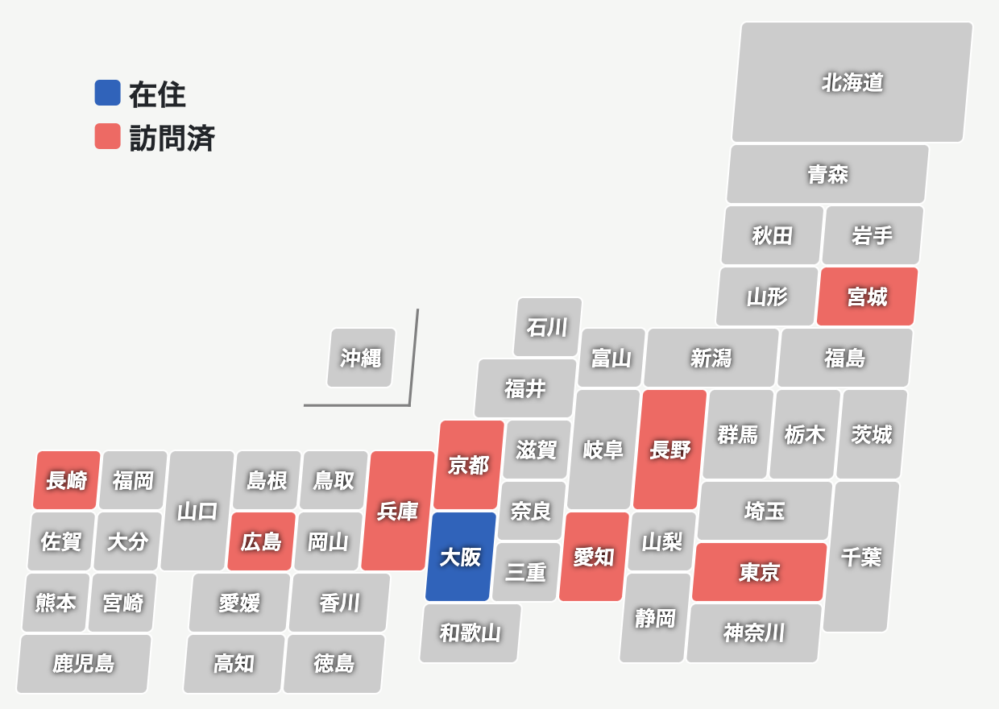
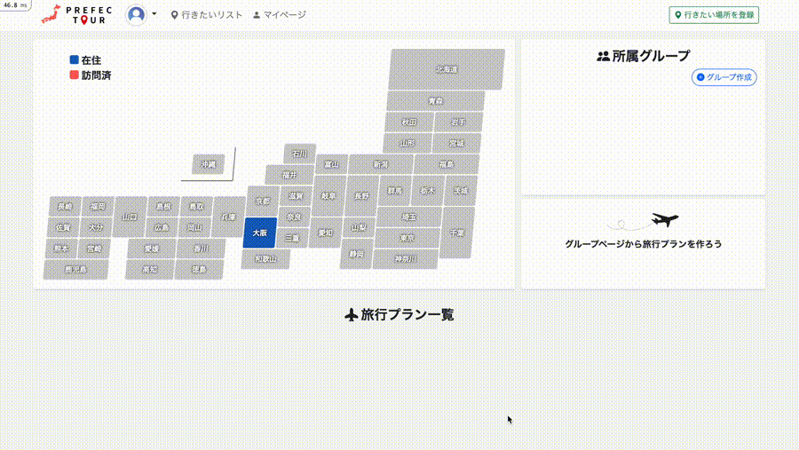
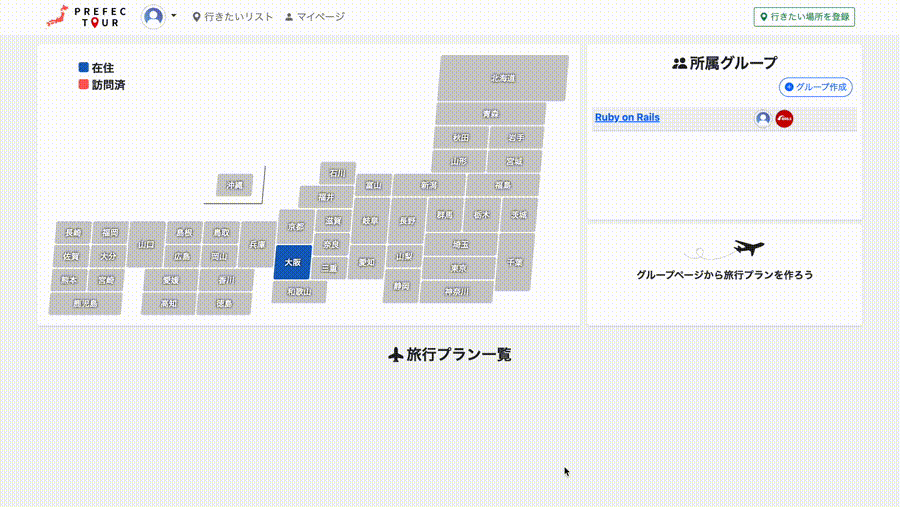
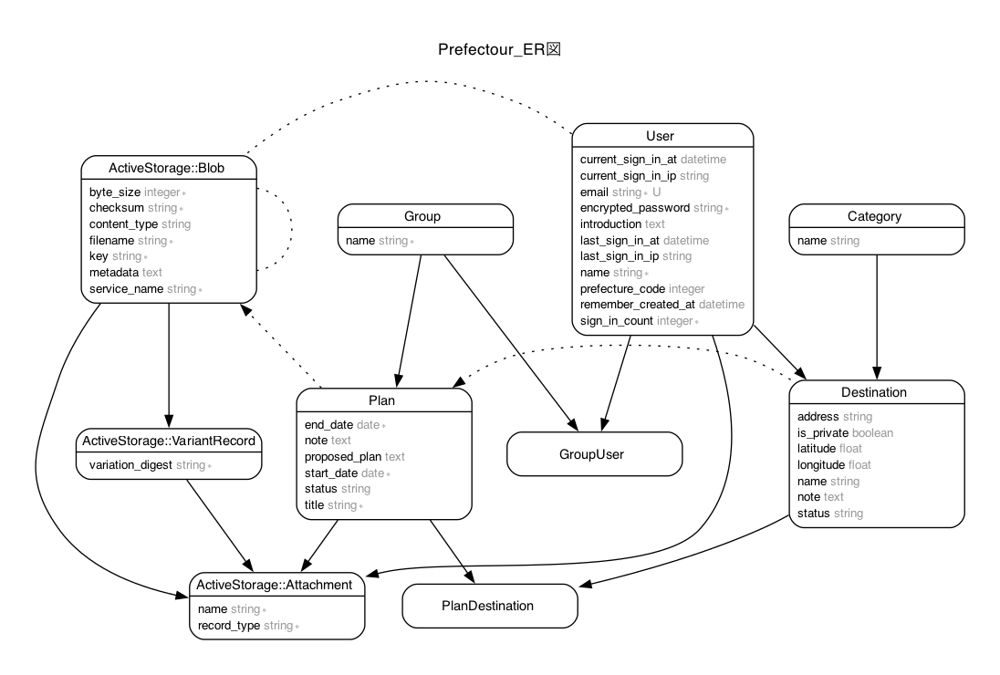

# Prefectour

  

 

  <strong>Prefectour</strong>は、「Prefecture（都道府県）」と「Tour（旅）」を組み合わせた造語です。 
  47都道府県を旅して巡るという夢に着想を得て開発しました。 
  訪れたい場所や思い出の記録、さらにはAIを活用した旅行計画の作成まで、 
  旅行に関するあれこれを一元管理できます。

  
 

### 🌐 URL  
ゲストログイン機能を利用すれば、ユーザー登録不要でアプリを体験できます。  
https://prefectour-3c006b5b690f.herokuapp.com/about

スマートフォン・タブレットにも対応しています。  

 
 

## アプリ開発の背景
日本には数多くの魅力的な観光地がありますが、忙しい日々の中で旅行計画を立てるのは、意外と手間がかかるものです。  
行きたい場所を調べ、他のメンバーの希望をまとめ、計画を立てて共有するという作業は楽しい面もありますが、時間と労力を要します。

**Prefectour**は、「全国47都道府県を夫婦で旅して巡りたい」という夢に着想を得て生まれたアプリです。  
「旅行計画をもっと簡単に、楽しく、そして記録として形に残せるツールを作りたい」という思いで開発を始めました。
 
 

## 主な機能
当アプリでは、特に以下の機能に注力して開発しました。

### 1. 行きたい場所の登録と管理
Google maps APIを活用し、訪れたい場所や写真スポットを簡単に保存することができます。
登録したリストをもとに、スムーズに旅行プランを立てられます。  

### 2. グループ機能
家族や友人とグループを作成し、旅行プランを共有・編集することが可能。複数人での計画がより便利になります。

### 3. AIによる旅行プランの生成
指定した目的地をもとに、AIが旅行プランを生成します。効率的なプランニングをサポートするだけでなく、追加のおすすめ情報が提案されることもあります。

### 4. 思い出の保存
旅行プランには写真やメモの追加が可能。旅行後も簡単に思い出を振り返ることができます。

### 5. 旅の軌跡を可視化
訪れた都道府県が日本地図に表示され、日本全国を巡る過程を一目で確認できます。次の旅行先を考えるのに役立つほか、思い出を振り返るきっかけにもなります。  

  

 
 

## 📝 使い方
### 行きたい場所を登録
- マップ検索で名称と住所が自動入力されます。
- 非公開に設定すると、グループ画面の目的地リストに表示されなくなります。

    
 

### グループページから旅行プランを作成
- グループの目的地リストから行きたい場所を選び、旅行プランを作成します。

    
 

### 思い出を保存  
- 旅行プランごとに写真を3枚まで追加できます。
- 訪問した都道府県は、日本地図上で色がつきます。

    
 
 

## ER図

 
 

## ⚙ 使用技術

| 項目         | 内容                                                      |
| ------------ | --------------------------------------------------------- |
| バックエンド | **Ruby on Rails** |
| フロントエンド | **HTML, CSS, JavaScript** |
| コード解析 | **Rubocop** |
| テスト | **RSpec** |
| データベース | **PostgreSQL** |
| ストレージサービス | **Amazon S3** |
| 旅程の自動生成機能 | **OpenAI API** |
| 地図機能と位置情報の取得 | **Google Maps API** |
 
 

## 📌 今後の課題
現時点では実力や時間の制約により実装を見送りましたが、将来的には以下の機能を追加する予定です。  

- **日本地図から旅行プランへのアクセス機能**  
  日本地図上の都道府県をクリックすると、その地域に関連する旅行プランが一覧表示される機能を追加します。これにより、旅行の振り返りがより便利になります。

- **グループ作成時のユーザー検索機能**  
  他のメンバーを簡単に検索してグループに招待できるよう、検索フォームを追加します。

- **Deviseのメール認証機能（Confirmable）**  
  セキュリティや信頼性向上のため、メールアドレスの認証機能を導入します。
